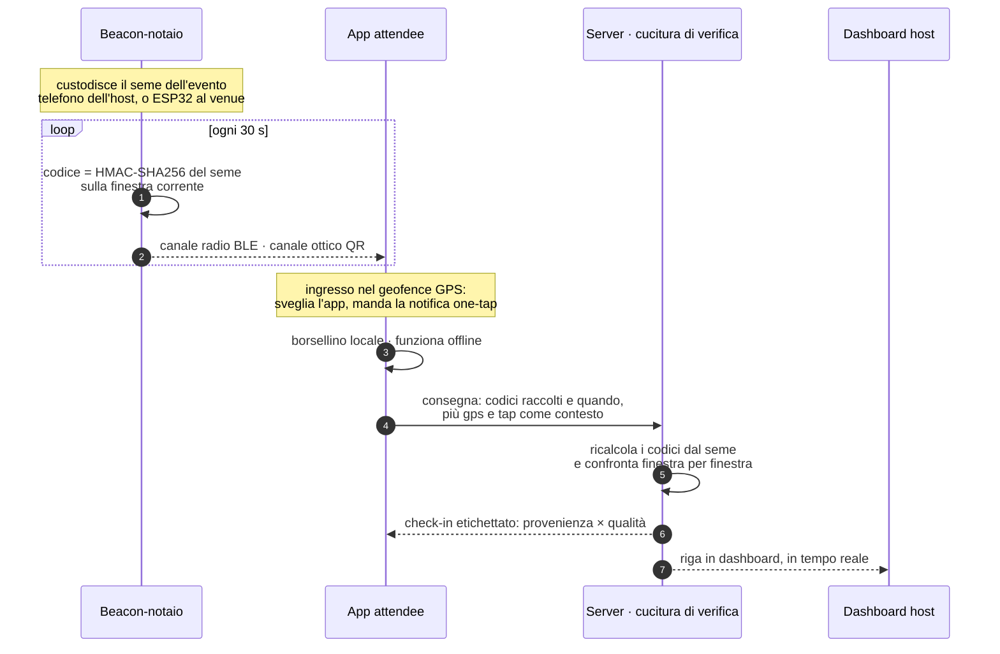

# Ripensare il check-in dei WeMeet

**La posizione si dichiara, la prossimità si dimostra, la permanenza si conferma.**

Business case WeRoad — risposta di Emanuele Puccetti, agosto 2026.

- **Demo live** (funziona da telefono e da laptop, niente da installare): https://attendee-arrival-web.vercel.app
- **API** (la cucitura di verifica, in produzione su Vercel + Postgres): https://attendee-arrival-api.vercel.app/health
- **Sandbox d'attacco**: si apre dalla console dell'evento che crei, o direttamente da `…/attacker/<id-evento>`
- **Codice**: https://github.com/puccez/attendee-arrival — Turborepo TypeScript
  nello stack di WeRoad (NestJS, Nuxt/Vue, core condiviso, app Expo/React
  Native) più il firmware C del beacon ESP32, con test di parità fra i due

**Come leggere.** In due minuti: la tabella di tracciabilità (§1) e il meccanismo (§3).
In dieci: aggiungi l'anti-frode (§6) e apri la demo mentre lo leggi. In mezz'ora:
il reality check (§9) è la parte che non troveresti in una presentazione.

---

## 1. Tracciabilità: cosa chiede il brief, dove sta la risposta

| Il brief chiede | La risposta | Dove provarlo |
|---|---|---|
| Arrivo auto-rilevato via **geofencing** | Geofence circolare attorno al venue: l'ingresso sveglia l'app e prepara il check-in. **L'Arrivo non è un check-in**: è l'invito a produrne uno | Home della demo → «Crea evento demo qui» piazza il geofence sulla tua posizione reale (150 m). Allontanati e torna |
| **Notifica one-tap** di conferma | Invito one-tap all'ingresso nel geofence. Il tap è un segnale di coerenza che *arricchisce* un check-in, non lo crea | Vista attendee: compare «Sei arrivata al venue → Confermo, sono qui» |
| **QR** come fallback quando il geofencing non è affidabile | Il QR è il **canale ottico** dello stesso segreto che viaggia via radio. Non è un biglietto: **ruota ogni 30 secondi** | Console host: il QR cambia sotto i tuoi occhi. Vista attendee: fotocamera → «codice raccolto» |
| **Non-negoziabile: fermare i check-in falsi** | Il GPS non è mai una prova. La prova è aver ricevuto un segreto effimero emesso *al venue, in quel minuto*. Le quattro frodi del brief, più il replay tardivo, sono eseguibili dal vivo | **Sandbox d'attacco**: ogni attacco parte davvero e atterra in dashboard con la sua etichetta (§6) |
| Segnali che distinguono posizione genuina da spoofata | Sezione dedicata — usati come contesto e come telemetria antifrode, mai come accreditamento | §6.6 |
| Cosa succede se l'attendee ignora la notifica | Cascata dichiarata: tap → nessun tap ma codici → nessun codice ma Arrivo → prompt all'host | §7.2 |
| Come l'host vede lo stato in tempo reale | Dashboard con provenienza × qualità per ogni riga, battito del beacon, testimonianza umana a un tap | Console dell'evento (§5) |
| Edge case: back-to-back, niente rete, check-in di gruppo | Seme per-evento; borsellino offline con prova autodatante; rifiuto esplicito del «garantisco io per i miei amici» | §8 |

I tre requisiti letterali ci sono tutti. Quello che cambia è il **peso** che portano:
geofencing e notifica diventano UX (svegliano il flusso), il QR viene promosso da
fallback a trasporto di prima classe della prova. Questo ribaltamento **è** la
risposta al non-negoziabile, e il resto del documento spiega perché.

---

## 2. Il problema: cosa vuol dire «più difficile da falsificare»

Oggi il check-in è un tap sull'onore. Chi tappa dichiara: *«sono qui»*. Il
sistema registra la dichiarazione e la chiama presenza.

La tentazione naturale è irrobustire la dichiarazione: aggiungi il GPS, aggiungi
il geofence, aggiungi euristiche antispoofing. Il problema è che **il GPS è una
dichiarazione del device, e il device è dell'attendee**. Su Android una mock
location è un'impostazione di sviluppo; su iOS bastano strumenti da desktop; su
un telefono con root, qualunque euristica gira dentro il processo che stai
cercando di verificare. Ogni difesa GPS è una corsa agli armamenti che si combatte
sul terreno dell'avversario, contro un avversario che per un aperitivo gratuito
non ha nemmeno bisogno di impegnarsi.

C'è però una cosa che l'attendee non controlla: **cosa succede al venue**. Se al
locale accade qualcosa di imprevedibile, che cambia ogni mezzo minuto e si può
percepire solo standoci dentro, allora «esserci» smette di essere un'affermazione
e diventa un fatto verificabile.

Da qui i tre movimenti della tesi:

- **La posizione si dichiara.** GPS e geofence restano — ma come innesco, mai come prova.
- **La prossimità si dimostra.** Serve la dimostrazione di aver ricevuto qualcosa che esisteva solo lì, solo allora.
- **La permanenza si conferma.** Un check-in istantaneo non dice se sei rimasto. La permanenza si misura, non si presume.

E un principio che governa tutto il resto: **ogni check-in porta l'etichetta di
chi lo ha confermato**. Il sistema non si riduce a un verdetto binario
«presente/assente» né a un punteggio opaco: produce un fatto con la sua
provenienza attaccata, e chi consuma il dato decide quanto vale. (Un campo
`accredited` esiste, per comodità di chi legge — ma è una *conseguenza*
dell'etichetta: dice «almeno un testimone c'è», non sostituisce né il chi né
il quanto.)

---

## 3. Il meccanismo: un notaio al venue, un codice che ruota

### 3.1 Il beacon-notaio

Al venue c'è un **beacon-notaio**: qualcosa che certifica tempo e luogo senza
guardare nessuno. Non è un checkpoint, non tiene registri, non vede chi passa.
Custodisce il **seme dell'evento** — un segreto casuale a 256 bit generato dal
server alla creazione dell'evento — ed emette continuamente un codice derivato da
quel seme.

Chi gioca il ruolo del notaio:

- **Default: il telefono (o il laptop) dell'host.** La console dell'evento è già
  aperta per altri motivi: mostra il codice come QR. Ora di rete dei telefoni
  (e se è storta, i codici non combaciano: il guasto è visibile, non
  silenzioso), connettività, zero hardware da gestire, zero flotta da mantenere
  in decine di città.
- **Ottimizzazione: un dispositivo fisso** (un ESP32 da pochi euro) nei venue
  ricorrenti, dove vale la pena avere il canale radio sempre acceso.

Il seme è **per-evento**: comprometterlo non dà più di quanto l'host di quell'evento
già possa fare. Non esiste una chiave globale da proteggere.

### 3.2 Il Codice Rotante

```
codice = tronca( HMAC-SHA256( seme_evento, indice_finestra ) )
indice_finestra = floor( unix_ms / 30_000 )
```

È la stessa costruzione di un TOTP (troncatura dinamica in stile RFC 4226), con
tre proprietà che ci servono tutte:

1. **È imprevedibile senza il seme.** Vedere mille codici passati non aiuta a
   indovinare il prossimo.
2. **È autodatante.** Il codice del minuto N *prova* il minuto N. Anche consegnato
   ore dopo, non può fingere di appartenere a un altro momento: il server
   ricalcola il codice atteso per l'istante dichiarato e confronta. Dichiarare
   un orario diverso rompe la corrispondenza.
3. **È piccolo.** Sei cifre decimali, cioè 20 bit: entrano nei 32 bit dei campi
   *major*/*minor* di un frame iBeacon. Lo stesso numero che sta in un QR sta in
   un pacchetto BLE — ed è per questo che i due canali possono trasportare la
   stessa cosa.

Il server accetta la finestra corrente **più le due adiacenti**, per assorbire lo
skew d'orologio fra beacon e telefono. Conseguenza diretta e dichiarata: **un
codice trapelato resta verificabile solo per la finestra in cui è nato** —
dichiarare un orario diverso rompe la corrispondenza. Per quanto tempo resti
*consegnabile* è un'altra domanda, e la risposta onesta passa dalla finestra di
consegna offline: il conto è in §6.3.

### 3.3 Un codice, due canali

|  | **Canale radio (BLE)** | **Canale ottico (QR)** |
|---|---|---|
| Come arriva | Il telefono ascolta l'advertising e cattura il codice **senza alcun gesto**, col telefono in tasca | L'attendee inquadra il QR sullo schermo dell'host |
| Dove vince | Indoor, dove il GPS muore. Zero attrito. Misura la permanenza da sola | Universale: nessun permesso Bluetooth, nessuna app necessaria, funziona anche dal browser |
| Cosa richiede | App nativa con permessi BLE | Un gesto volontario dell'attendee |

Sono lo stesso segreto su due trasporti. **Il server non distingue i due canali**:
riceve codici e li verifica, punto. Questo è il motivo per cui il degrado è
graduale invece che catastrofico — chi non ha l'app usa il browser e il QR, chi ha
l'app non fa niente e il check-in si produce da solo.

### 3.4 Il flusso, per intero



Il GPS compare una volta sola, e come innesco. Non entra mai nel giudizio.

---

## 4. L'etichetta: due assi, nessun punteggio

Un «trust score» da 0 a 100 sembra rigoroso e non lo è: comprime informazioni
diverse in un numero che nessuno sa più interpretare, e quando sbaglia non si
riesce a spiegare perché. Qui ogni check-in porta due etichette **ortogonali**.

**Provenienza — chi conferma** (discreta, *non* una scala):

- **macchina** — codici consegnati e verificati. A rigore prova che quel
  borsellino *ha ricevuto i codici del venue* — di norma standoci; altrimenti
  al prezzo di un complice presente (§6.3).
- **umano** — l'host ha verificato *la persona* davanti a sé.
- **macchina + umano** — il caso più forte: device e persona.
- **nessuno** — solo autodichiarazioni (GPS, tap). Registrato, **mai accreditato**.

Macchina e umano non sono ordinate perché provano cose diverse. È il punto in cui
il modello smette di essere un'euristica e diventa una struttura.

**Qualità — quanto è solido** (continua): quanti codici validi distinti, quanta
**copertura** di permanenza, il buco più lungo fra due codici, quanto era
vecchia la prova quando è arrivata al server, e se c'è stato il tap sulla
notifica.

La copertura merita una riga in più, perché **non è «ultimo codice meno
primo»**. Si guarda un intervallo alla volta, fra due codici validi
consecutivi, e lo si accredita per la sua durata — ma mai oltre un tetto (10
minuti di default). Se fra due codici il client ha dichiarato un'uscita dalla
region del beacon, quell'intervallo vale zero. Le conseguenze sono volute: chi
sparisce un'ora si vede accreditare al massimo il tetto, che lo dichiari o no;
e le sessioni dichiarate possono solo *tagliare* tempo, mai aggiungerne — per
questo è sicuro accettarle da un client non fidato. Il numero che ne esce
sottostima l'arco osservato per costruzione — con un'onestà in più da dire:
dentro un buco più corto del tetto si può essere usciti e rientrati, quindi il
tetto non è una garanzia fisica ma il limite massimo dell'errore per
intervallo. Si legge insieme al buco più lungo, che dice quanto è ruvido il
campionamento.

Come si legge, in pratica:

| Provenienza | Qualità | Lettura | Uso tipico |
|---|---|---|---|
| macchina | 12 codici, 94 min | Presenza piena, permanenza confermata | Badge e metriche di engagement; per i benefici con valore reale, le policy qui sotto |
| macchina | 1 codice, 0 min | C'era. Non è rimasto | Presenza sì, ricompense legate alla permanenza no (§6.4) |
| umano | — | L'host ha visto la persona. Nessuna prova del device | Presenza sì; il rischio è la frode sociale, dichiarata (§9) |
| macchina + umano | 8 codici, 71 min | Il caso più forte disponibile | Qualunque cosa |
| nessuno | tap ✓, GPS dentro | Una dichiarazione, e nient'altro | Colpo d'occhio dell'host; **mai** presenza |

La frode ai livelli bassi non è prevenuta: è **prezzata**. Chi consuma il dato —
metriche di community, gamification, criteri di selezione per gli host — decide
quanto vale ogni combinazione, con l'informazione davanti agli occhi invece che
compressa in un numero.

Decide — ma non a mani vuote. Rifiutare il punteggio unico non significa
rifiutare le soglie: significa che le soglie sono **per uso**, dichiarate e
discutibili, invece che cablate in un numero che le nasconde. Queste sono le
policy con cui il sistema si presenta:

| Uso del dato | Soglia consigliata |
|---|---|
| **Contare la presenza** («c'eri») | `macchina` (≥ 1 codice valido) *oppure* `umano` |
| **Ricompense di permanenza** (badge, streak) | `macchina` con copertura ≥ 45 minuti e buco più lungo ≤ 20 |
| **Benefici con valore reale** (referral, selezione host) | `macchina + umano`; la biometria al tap (hardening §12) si *aggiunge* contro il prestito del telefono — non sostituisce lo sguardo dell'host, perché lega la persona al device, non il device al venue |
| **Solo dichiarazioni** (GPS, tap) | mai un accreditamento |

Due onestà a corredo. La prima: il ritardo di consegna alto non distingue
l'offline onesto dall'inoltro differito (§6.3) — per gli usi che contano, la
riga arrivata in ritardo non si nega d'ufficio, si porta all'host, che la
serata l'ha vista. La seconda: i numeri sono punti di partenza, si tarano sul
campo guardando le distribuzioni reali di copertura e buchi (§11). Quello che
non si tara è la struttura: **ogni uso più prezioso richiede un testimone in
più, mai un punteggio più alto.**

---

## 5. Cosa vedono le persone

### L'attendee

1. Si avvicina al venue. L'app rileva l'ingresso nel geofence e manda **una
   notifica: «Sei arrivata al WeMeet? Conferma»**. Un tap.
2. **Con l'app nativa non deve fare altro.** Il telefono, in tasca, sta già
   raccogliendo i Codici Rotanti via BLE. Il check-in si produce da solo e la
   permanenza cresce durante la serata.
3. **Dal browser** (o se il Bluetooth è spento) inquadra il QR sullo schermo
   dell'host. Un gesto, due secondi. Ri-inquadrandolo più tardi la permanenza sale.
4. Vede il proprio stato: codici raccolti, minuti di permanenza, accreditato o no.
   Nessun punteggio misterioso.

### L'host

La console mostra, aggiornata in tempo reale:

- **il Codice Rotante** come QR grande, che cambia ogni 30 secondi;
- **il battito del beacon** («emissione attiva da 47 min»), perché un notaio morto
  deve essere rumoroso, non silenzioso;
- **la tabella degli arrivi**: nome, provenienza, numero di codici, minuti di
  copertura, tap, accreditato;
- **un bottone «Testimonia di persona»** sulle righe deboli: telefono scarico,
  permessi negati, niente app — l'host guarda la persona, tocca, e il check-in
  diventa `umano`. Nessuno resta fuori dal dato, ed è etichettato per quello che è.

L'obiettivo di prodotto: **all'host resta l'accoglienza, non la burocrazia**. La
dashboard è un colpo d'occhio e un pulsante per le eccezioni, non un registro da
compilare.

---

## 6. Anti-frode: le quattro frodi del brief, eseguibili dal vivo

Ogni attacco qui sotto è **un bottone nella sandbox**. Parte davvero, colpisce
davvero l'API di produzione, e l'esito atterra sulla dashboard dell'host con la
sua etichetta. Consiglio: apri la console e la sandbox affiancate.

### 6.1 GPS spoofato

**L'attacco.** Mock location dal divano: il device dichiara di essere dentro il geofence.

**Cosa succede.** `provenienza: nessuno`, **non accreditato**. Il GPS non produce
mai un check-in: non è una difesa che ha rilevato lo spoofing, è che **la
dichiarazione di posizione non è nella catena di prova**. Non c'è euristica da
battere perché non c'è euristica.

**Perché è la mossa giusta.** Rende un'intera classe di attacchi irrilevante *per
costruzione* invece che *per rilevamento*. Nessuna corsa agli armamenti da mantenere.

### 6.2 L'amico che tappa «confermo» per te

**L'attacco.** Qualcuno tappa la notifica di conferma da casa, o per conto di un altro.

**Cosa succede.** `provenienza: nessuno`, **non accreditato**. Il tap viene
registrato nella qualità (`tap ✓`) ma non crea nulla: **il tap arricchisce un
check-in, non lo produce**. Senza prova di prossimità non c'è niente da arricchire.

Questo è anche il motivo per cui la notifica one-tap del brief può restare
un'esperienza leggera e piacevole: **non deve difendere niente**. Se dovesse
portare il peso della prova, servirebbero biometria e frizione a ogni conferma.

### 6.3 QR screenshottato e inoltrato

**L'attacco.** Screenshotti il QR e lo giri su WhatsApp a chi è rimasto a casa.

**Cosa succede.** Dipende da come chi lo riceve consegna, e il conto onesto va
fatto in due tempi:

- **l'inoltro ingenuo** — chi riceve consegna il codice come appena raccolto —
  scade con la finestra: 30-60 secondi e viene respinto. È la fase che la
  sandbox mostra col contatore.
- **l'inoltro informato** — chi riceve dichiara l'ora di *nascita* del codice —
  passa finché la consegna resta dentro la finestra di ritardo (6 ore di
  default). È la stessa proprietà che fa funzionare l'offline (§8.2): il server
  non può distinguere una prova che ha aspettato la rete da una che ha
  viaggiato su WhatsApp. **La finestra di frode reale del canale inoltrato non
  è il minuto: è la finestra di consegna** — e la sandbox lo dichiara con
  queste stesse parole.

Offline generoso e inoltro che muore subito sono in tensione per costruzione:
si sceglie un punto sulla bilancia e lo si dichiara. La finestra di ritardo è
un parametro; e siccome l'istante d'arrivo di ogni codice lo timbra il server —
mai il client — ogni check-in espone **quanto era vecchia la prova quando è
arrivata** (`deliveryLagMinutes`): chi è al venue consegna in diretta, chi
spende uno screenshot ricevuto ore prima accumula prove che arrivano già
vecchie. Il ritardo smaschera l'inoltro *differito*; quello *in diretta* — un
bot che gira i codici al volo — ha ritardo quasi zero, e contro di lui resta
solo il costo del complice, sotto. Questa frode non si previene: si
restringe, si misura dove si può, e si lascia in vista.

**Perché regge comunque.** Perché la domanda si sdoppia. *Comprare la presenza*
costa un solo codice inoltrato — e produce la riga più debole del tabellone:
1 codice, 0 minuti di copertura, prova già vecchia all'arrivo. *Comprare la
serata* richiede un flusso di codici per ore, e nessuno li gira a mano: basta
una videochiamata puntata sul QR, che serve anche più amici remoti insieme. La
difesa non è l'aritmetica degli inoltri: è che serve comunque **un complice
fisicamente al venue per tutta la sera**, che la frode lascia una firma
leggibile nel dato (ritardi di consegna, copertura ricostruita a posteriori), e
che per un aperitivo gratuito il complice costa più del premio. Non
l'impossibilità: un costo sproporzionato all'incentivo, più una traccia.

Il dwell (§6.4) resta la difesa strutturale: un check-in sostenuto da un solo
codice inoltrato si distingue da solo dagli altri.

### 6.4 Check-in e fuga

**L'attacco.** Entri, raccogli un codice vero, e te ne vai dopo tre minuti.

**Cosa succede.** **Accreditato — e va bene così: eri lì davvero.** Ma la riga in
dashboard dice `machine · 1 codice · 0 minuti di copertura`, accanto a chi ha
`machine · 12 codici · 94 minuti`. Non esiste una soglia *globale* che decida chi
è «rimasto abbastanza»: esistono soglie per uso (§4), e la differenza resta
visibile accanto al numero.

Qui sta il senso di *la permanenza si conferma*: il sistema non prova a indovinare
se sei rimasto, **lo misura** — e quando non può misurarlo lo dichiara invece di
riempire il buco.

### 6.5 Bonus: replay tardivo

Consegnare codici «raccolti» ieri non funziona: oltre la **finestra di consegna in
ritardo** (6 ore di default, parametro della verifica) i codici vengono scartati. La finestra
esiste perché l'offline è normale (§8.2); il margine di replay che introduce è
esattamente quello messo a nudo in §6.3 — finito, misurato dal ritardo di
consegna, **dichiarato** invece che nascosto.

### 6.6 «Quali segnali distinguono una posizione genuina da una spoofata?»

Il brief lo chiede esplicitamente, e la risposta onesta ha due parti.

**I segnali esistono e li usiamo** — come contesto operativo e telemetria
antifrode, mai come accreditamento:

- **Dichiarazione della piattaforma.** Android espone `Location.isMock()` /
  `isFromMockProvider`; iOS espone `sourceInformation.isSimulatedBySoftware`. È il
  segnale più economico e il primo che un attaccante serio neutralizza.
- **Plausibilità fisica.** Teletrasporti (velocità implicita fra due fix
  impossibile), assenza di jitter (il GPS reale oscilla di qualche metro; un fix
  sintetico spesso è immobile al centimetro), accuratezza dichiarata irrealistica,
  altitudine costante a zero.
- **Corroborazione multi-sensore.** BSSID delle reti WiFi visibili confrontati con
  quelli noti del venue, cella telefonica, geolocalizzazione dell'IP, fuso orario
  del device, barometro. Sono economici e difficili da falsificare *tutti insieme
  e in modo coerente*.
- **Coerenza fra attendee.** Venti device che riportano coordinate identiche al
  decimale sono venti device che leggono lo stesso file, non venti persone in un bar.
- **Integrità del device.** Play Integrity e App Attest non dicono dove sei: dicono
  se l'app e il sistema sono quelli che dovrebbero essere. Alzano il costo di
  iniettare posizioni false.

**E però.** Ognuno di questi segnali è battibile da un device con root e un'app
modificata, e i falsi positivi colpiscono chi non ha colpe: chi ha il GPS scarso
in un seminterrato assomiglia molto a chi sta barando. Per questo tutti insieme
producono **contesto e allerte**, e nessuno di loro produce un accreditamento.

**La differenza sostanziale.** Un sistema che si difende con questi segnali deve
azzeccarli tutti, per sempre, contro un avversario che itera. Un sistema in cui
il GPS non è nella catena di prova non deve azzeccarne nessuno: se sono tutti
ingannati, l'attaccante ottiene esattamente `provenienza: nessuno`, che è quello
che otteneva prima di sforzarsi.

---

## 7. La notifica, e cosa succede quando viene ignorata

### 7.1 Cosa fa davvero la notifica

L'ingresso nel geofence sveglia l'app e manda la conferma one-tap. È **UX pura**:
riduce l'attrito e dà all'attendee il controllo esplicito («sì, sono qui»). Non
porta peso probatorio, e questo la rende leggera per progetto.

### 7.2 Se l'attendee la ignora — la cascata

Le notifiche vengono ignorate: è il caso normale, non l'eccezione. Il sistema
degrada su quattro gradini, senza che nessuno debba intervenire:

1. **Tap sulla notifica** → il check-in che i codici stanno già producendo si
   arricchisce di `tap ✓` nella qualità (il tap da solo non crea nulla: §6.2).
2. **Nessun tap, ma app nativa installata** → non cambia quasi niente: i codici si
   raccolgono via BLE senza gesti. Il check-in si produce comunque, con provenienza
   `macchina`. **Ignorare la notifica non è un fallimento del flusso.**
3. **Nessun tap e nessun codice** (app non installata, Bluetooth spento, browser)
   → l'attendee resta `nessuno` e in dashboard appare come *arrivato, non
   testimoniato*: è esattamente il caso per cui esiste il QR.
4. **Niente di niente** (telefono scarico, permessi negati, nessuna app) → l'host
   lo verifica di persona con un tap: provenienza `umano`. (Onestà dovuta:
   nella demo chi non ha mai prodotto nulla non compare da solo in lista — la
   riga nasce con la testimonianza. Il «registrato, mai visto» evidenziato
   d'ufficio richiede il join con gli iscritti, dichiarato in §9.2.)

Nessuno di questi gradini è un errore da gestire. Sono i modi normali in cui la
serata va, e ognuno ha una risposta prevista.

---

## 8. Edge case

### 8.1 Eventi back-to-back nello stesso venue

Ogni evento ha il **proprio seme**. I codici dell'evento A, verificati contro il
seme dell'evento B, semplicemente non corrispondono: chi indugia dopo l'evento A
non accredita presenze sull'evento B, e chi arriva presto per B non raccoglie
presenze su A. La consegna dichiara l'evento a cui l'attendee è registrato, e la
verifica avviene contro *quel* seme.

La *verifica* non ha bisogno di logica dedicata: è una conseguenza gratuita del
seme per-evento. La logistica dell'emettitore sì, ed è dichiarata: al cambio
evento il notaio passa al seme nuovo — un cambio di schermata in console — e
chi arriva presto per B raccoglie per B da quel momento in poi. (La finestra
oraria dell'evento è modellata ed è il punto naturale per un secondo filtro in
profondità — vedi §9.2.)

### 8.2 Attendee senza connessione dati

Il caso è frequentissimo: locali seminterrati, roaming, giga finiti. **L'offline
non è un caso d'errore**, è una modalità di funzionamento prevista.

- **La raccolta non usa la rete.** Fotocamera e Bluetooth funzionano offline. I
  codici finiscono in un **borsellino locale** (SQLite sul telefono, via PowerSync).
- **La consegna aspetta.** Quando la rete torna, la coda sale da sola: nessun
  bottone «sincronizza», nessuna azione da ricordare.
- **Il ritardo non degrada la prova**, perché **il codice è autodatante**: quello
  raccolto alle 21:14 prova le 21:14 anche se arriva al server a mezzanotte. La
  copertura si calcola sui momenti di raccolta, non su quelli d'arrivo al server.
- **Anche l'host può essere offline.** Per progetto il notaio riceve il seme una
  volta e deriva i codici in locale — è quello che fa l'ESP32 — quindi l'emissione
  sopravvive alla caduta della rete del locale. (Nella demo la console interroga
  l'API: §9.2.)
- **Il limite è dichiarato**: oltre la finestra di consegna (6 ore di default) i
  codici vengono scartati, perché una tolleranza infinita sarebbe un buco di replay
  infinito.

### 8.3 Check-in di gruppo

Qui la risposta è un **rifiuto esplicito**, ed è deliberato: *«garantisco io per i
miei tre amici»* **è** una delle frodi che il brief chiede di fermare (§6.2), solo
scritta con un'intenzione gentile. Un flusso di check-in di gruppo delegato sarebbe
l'attacco, promosso a funzionalità.

Cosa succede invece quando arriva un gruppo:

- **Ognuno raccoglie per sé, e non costa niente.** Con l'app nativa nessuno fa
  nulla: quattro telefoni nella stessa stanza raccolgono quattro volte. Col QR sono
  quattro inquadrature in dieci secondi — il QR è a schermo, non c'è coda, non c'è
  un varco.
- **Chi non può, passa dall'host.** Un telefono scarico nel gruppo è la casistica
  di §7.2 gradino 4: l'host testimonia quella persona, con provenienza `umano`.
- **Il gruppo emerge dal dato invece che essere dichiarato**: quattro check-in con
  la stessa finestra di arrivo e la stessa curva di permanenza *sono* un gruppo, e
  lo si vede senza chiedere a nessuno di garantire per nessuno.

L'evoluzione naturale è la **testimonianza tra pari** (§12): i telefoni si rilevano
a vicenda e i membri del gruppo si corroborano l'un l'altro — che è la versione
crittografica di «erano insieme», al posto della parola di uno solo.

---

## 9. Reality check

La parte che di solito non si scrive. Un valutatore tecnico competente cerca
questi punti: dichiararli per primi vale più che lasciarli trovare.

### 9.1 I limiti del modello

**Il beacon non «vede» i telefoni — e non deve.** L'intuizione sbagliata è un
beacon che scansiona i presenti. Non funziona: un'app iOS in background finisce
nella overflow area dell'advertising e un ESP32 non la vede, e i MAC BLE ruotano
per progetto. La direzione reale è **telefono-ascolta / beacon-parla**: la
testimonianza è **co-prodotta** (il beacon è l'ancora spazio-temporale, il telefono
è il sensore). È anche la variante migliore per la privacy — il beacon non registra
nessuno, perché non sa chi c'è. Precedente: le Exposure Notifications di
Apple/Google usano lo stesso schema di token rotanti, su scala planetaria.

**Il dwell è opportunistico, non continuo.** iOS concede circa 10 secondi di
esecuzione al risveglio da iBeacon: ingresso e uscita dalla region sono il
segnale più affidabile che il sistema conceda — non una garanzia: arrivano con
ritardi di decine di secondi e vanno trattati come eventi *probabili*, da
verificare sul campo. I campioni intermedi arrivano quando l'utente apre il
telefono (frequente a un aperitivo) o su silent push — che richiede rete e può
essere ritardato o soppresso dal sistema: un aiuto, non un meccanismo su cui
contare. Android, con lo scanning via `PendingIntent`, è più generoso. Quindi:
**la permanenza è un limite inferiore osservato, non una misurazione
continua**, e va letta così. Chi vuole permanenza densa con la certezza del
secondo deve inquadrare il QR ogni tanto o accettare l'incertezza. Non è una
previsione, è una riga vera di collaudo: un iPhone lasciato una notte intera
accanto al beacon-notaio, schermo bloccato, chiude a `25 codici · 100 minuti
di copertura · buco più lungo 81` — il telefono che dorme testimonia poco, il
sistema accredita solo quello, e il numero dice esattamente ciò che è successo. I numeri
veri — tassi di risveglio, buchi tipici per piattaforma — non si deducono
dall'esistenza delle API: si misurano con distribuzioni sul campo. La fase 0
del rollout (§11) misura i flussi ottici e i passaggi dall'host; i risvegli
nativi si misurano dalla fase 1, la prima che ha un'app da svegliare.

**La finestra di frode del canale inoltrato è quella di consegna, non il
minuto.** Un codice inoltrato e consegnato dichiarando la sua ora di nascita
resta accreditabile finché la finestra di ritardo è aperta — il conto intero è
in §6.3. Il ritardo di consegna smaschera l'inoltro differito; quello in
diretta non si previene: si prezza. Reggere l'inganno per una serata richiede
un complice presente che alimenti il flusso in continuazione: è il costo che
rende l'attacco irrazionale, non un'impossibilità matematica.

**Telefono ≠ persona.** La provenienza `macchina` prova, a rigore, che quel
device *ha ricevuto i codici del venue* — standoci, o tramite il relay prezzato
in §6.3. Il legame device↔persona resta il limite strutturale, ed è esattamente
perché esiste che `umano` è un asse separato e non un gradino inferiore. Si mitiga
con biometria on-device (FaceID / WebAuthn user verification) e device attestation
(Play Integrity / App Attest) — hardening previsto, non implementato in questa demo.

**La porta della copertura non si chiude, si etichetta.** Telefono scarico,
permessi negati, nessuna app: **ogni** design ha attendee non rilevabili
automaticamente. Le cure disponibili — biometria centralizzata, documento
d'identità, nessun fallback — costano più del male, per un evento social gratuito.
Il fallback resta il testimone umano, con la sua frode sociale dichiarata: un host
compiacente può spuntare chi vuole. È un rischio che WeRoad già corre oggi, con la
differenza che ora **è visibile nel dato** invece di essere indistinguibile dal resto.

**ESP32 senza RTC.** Un dispositivo fisso senza orologio a batteria, dopo un
power-cycle, riparte con l'ora sbagliata e produrrebbe codici che nessuno può
verificare. Il firmware lo affronta di petto — NTP all'avvio, ora impostabile da
seriale, e un valore sentinella nel frame finché l'orologio non è valido (§10) —
ma resta un pezzo di hardware che può degradare in silenzio se nessuno guarda: per
questo esiste il battito del beacon in dashboard. Ed è l'argomento più forte per
cui il default di prodotto resta il telefono dell'host: ora di rete che si
tiene giusta da sola (e che quando sbaglia produce codici respinti, non frodi),
connettività, nessuna flotta da gestire in decine di città.

### 9.2 I limiti di questa implementazione

La demo è una demo. Cosa manca per la produzione, e dove sta:

| Oggi nella demo | In produzione |
|---|---|
| **Nessuna autenticazione**: l'identità del device è un UUID in `localStorage`, e la porta della testimonianza è aperta come le altre | Account WeRoad autenticato + binding del device; la consegna arriva già identificata, e la testimonianza richiede il ruolo host (con audit log) |
| **Nessun rate limiting** sull'endpoint di consegna. Lo spazio dei codici è 10⁶ e ogni codice vive ≤ 60 s, quindi il brute force è già poco pratico — ma «poco pratico» non è «impedito» | Rate limit per device e per IP, lockout dopo N codici invalidi consecutivi. È una riga di middleware, ma va scritta |
| **La finestra oraria dell'evento non è applicata** in verifica: la separazione back-to-back la garantisce il seme per-evento, che è il meccanismo primario | Secondo filtro `startsAt ≤ collectedAt ≤ endsAt` come difesa in profondità (il dato è già nel modello) |
| **La console interroga l'API** per il codice corrente | Il notaio riceve il seme una volta e deriva in locale — come già fa l'ESP32 — così l'emissione sopravvive alla rete dell'host |
| **La dashboard mostra i device che hanno consegnato qualcosa** | Join con la lista degli iscritti all'evento: «registrato, mai visto» diventa una riga visibile, non un'assenza |
| **La dashboard aggiorna in polling** ogni 2 secondi | Realtime/websocket (Supabase Realtime è già nello stack) |

Nessuna di queste voci cambia il modello di fiducia: sono lavoro di produzione,
non ripensamenti.

---

## 10. Cosa è costruito davvero, e come si innesta

Non è un mockup: è codice funzionante nello **stack di WeRoad**, deployato.

**`packages/core`** — il cuore, condiviso da tutti i lati: derivazione del Codice
Rotante e valutazione delle consegne. **13 test** che sono la specifica eseguibile
del modello di fiducia (codice valido, replay, skew, back-to-back, offline dentro e
fuori finestra, dwell, tocca-e-fuggi, GPS-solo, testimonianza umana, tap).

**`apps/api`** — **modulo NestJS** con la cucitura di verifica: **due porte di
scrittura, separate per costruzione**. `POST /events/:id/deliveries` riceve ciò
che l'attendee afferma di aver raccolto — `{deviceId, codes[+quando], gps?,
confirmationTap?}` — e restituisce il check-in etichettato;
`POST /events/:id/attestations` riceve ciò che l'host afferma di aver visto.
Non entrano dalla stessa porta perché nessun borsellino deve potersi
accreditare da solo la parola di qualcun altro. Tutta l'intelligenza di fiducia
vive dietro quelle porte. **7 test e2e** black-box
sull'HTTP. Persistenza su Postgres (Supabase). Il modulo è **sollevabile e
innestabile nel backend WeRoad così com'è**.

**`apps/web`** — Nuxt/Vue: console host, vista attendee, sandbox d'attacco. È il
livello web *vero* del prodotto (il fallback universale), non un mock del nativo.

**Borsellino local-first** — PowerSync + SQLite: i codici si raccolgono offline e
salgono via `uploadData` **alla cucitura di verifica, mai con scritture dirette al
database**. Lo stato etichettato torna giù dal sync stream, filtrato per device.

**`firmware/`** — il **beacon-notaio fisico**: un ESP32 che emette il Codice
Rotante come frame iBeacon. UUID di prossimità fisso (è l'identità su cui iOS
sveglia l'app: non può ruotare), codice nei campi *major*/*minor* con una
divisione decimale scelta apposta perché uno scanner BLE generico mostri
`major 12 / minor 3456` e tu legga **123456** senza convertire niente — così il
canale radio si verifica con nRF Connect e il confronto con il QR della console è
a occhio nudo. La derivazione è C puro senza dipendenze crittografiche, e **4 test
di parità** verificano che TypeScript e C producano lo stesso codice sugli stessi
input, con gli stessi confini di finestra. Il seme si provisiona a caldo da
seriale: non serve riflashare fra un evento e l'altro.

**Il limite dell'orologio, gestito rumorosamente.** L'ESP32 non ha RTC a batteria
(§9.1). All'avvio sincronizza via NTP, o riceve l'ora da seriale; finché l'ora non
è valida **annuncia comunque l'UUID** — così il risveglio dell'app in prossimità
continua a funzionare — ma con `major=0 minor=0`, che significa «orologio non
sincronizzato». Fallisce a voce alta invece di emettere in silenzio codici che
nessuno accrediterà. (La sentinella ha una collisione dichiarata: la troncatura
può produrre legittimamente «000000», una finestra su un milione. Sul canale
radio quella finestra è indistinguibile dall'orologio rotto e si sacrifica — 30
secondi di copertura in meno, assorbiti dal tetto degli intervalli; sul canale
ottico l'ambiguità non esiste.)

**Sul canale radio nella demo web.** Quello che gira nel browser è il **canale
ottico**: stesso codice, stessa verifica, trasporto diverso. Nessun browser può
ascoltare l'advertising BLE in background, quindi la demo web lo dichiara invece
di simularlo. È anche il motivo per cui la web app non è un mockup del nativo:
**è il livello di fallback del sistema reale**, quello che serve a chi non ha
l'app, ha il Bluetooth spento, o è appena arrivato e non ha installato niente.

**Perché si innesta senza attrito.** Lo stack è lo stesso di WeRoad, adottato 1:1:
il modulo NestJS entra nel backend, il modulo client entra nell'app Expo, i
componenti Nuxt entrano nel frontend. Ma la ragione strutturale è un'altra: **tutta
la logica di fiducia è server-side**, quindi i client sono sottili e sostituibili.
Il contratto è la cucitura (API di verifica + formato del frame beacon), non un
framework da adottare.

---

## 11. Rollout

**Fase 0 — nessun hardware (settimana 1).** L'host apre la console: il suo telefono
è il notaio. Canale ottico via QR. Funziona da subito in tutte le città, senza
logistica. Si raccoglie il dato di base: quanti check-in con prova, quanta
permanenza, quanti passaggi dall'host.

**Fase 1 — app nativa.** Il modulo attendee entra nell'app WeRoad esistente:
region monitoring per il risveglio, cattura BLE dei codici, push one-tap, stesso
borsellino. E il canale radio ha un emettitore definito: la stessa app, giocata
dall'altro lato — il telefono dell'host in **modalità notaio** deriva il Codice
Rotante in locale e lo emette come iBeacon, in primo piano e a schermo acceso
(è il vincolo dichiarato di un notaio-telefono, §9.1), finché un beacon fisso
non lo rimpiazza in fase 2. Non è un'intenzione: è costruita nel modulo nativo
e provata nei due versi — notaio iPhone → attendee Android e viceversa. **Il
server non cambia**: è la stessa API, gli stessi codici, la stessa etichetta.
Il canale ottico resta il fallback universale.

**Fase 2 — beacon fissi dove conviene.** L'ESP32 nei venue ricorrenti (firmware
in `firmware/`, §10): canale radio sempre acceso, zero gesti, campionamento più
denso dove il sistema operativo lo concede (Android generoso, iOS opportunistico
— §9.1: un emettitore continuo non rende continuo il ricevitore).
Costa pochi euro a venue, si provisiona in un minuto e resta acceso. È
un'ottimizzazione per venue, non un prerequisito — e ogni venue che non ce l'ha
continua a funzionare come in fase 0.

Ogni fase è utile da sola e nessuna rompe la precedente. Se la fase 2 non arriva
mai, il sistema resta in piedi.

**Privacy e GDPR.** Il design è privacy-ottimale quasi per accidente: il beacon
**non registra nessuno**, perché non può vedere chi c'è. Il dato raccolto è la
minima informazione utile — quali codici e quando — e i codici sono valori senza
significato fuori dall'evento. La minimizzazione del dwell (conservare l'arco
temporale aggregato invece dei singoli campioni), una retention breve sui campioni
grezzi e il consenso esplicito per la permanenza sono le tre decisioni da prendere
con il DPO; il modello le rende tutte praticabili senza toccare il meccanismo.

---

## 12. Evoluzioni

**Testimonianza tra pari.** I telefoni dei partecipanti si rilevano a vicenda via
BLE e riportano gli incontri: le presenze si corroborano l'un l'altra. Rafforza i
gruppi senza flussi dedicati, aggiunge ridondanza se il notaio muore a metà serata,
e aggiunge un segnale contro il complice remoto — chi riceve codici inoltrati
**non è visto da nessun pari**. (Un segnale, non uno smascheramento: l'assenza
di incontri può dipendere anche da permessi, background e telefoni che non
partecipano.)
È lo schema delle Exposure Notifications. Fuori dalla prima versione perché alza
la superficie privacy (i partecipanti si tracciano a vicenda: serve consenso
dedicato) e la complessità client.

**L'host-scan, ovvero l'alternativa forte — considerata.** Il ribaltamento del
design: l'host inquadra un QR personale e dinamico sul telefono dell'attendee,
invece che l'attendee inquadrare quello del venue (un tap NFC al posto del QR
cambia il trasporto, non la struttura). È l'alternativa più seria a questo
progetto e merita il confronto esplicito. Cosa compra: il legame più stretto
fra prova e persona ottenibile senza biometria — un umano guarda chi tiene in
mano il telefono mentre la macchina verifica il token, a patto che il QR
personale sia legato all'account autenticato, con nome e foto davanti agli
occhi dell'host. Cosa costa: un varco.
L'host deve inquadrare ogni arrivato, uno alla volta; a un aperitivo da
cinquanta persone il check-in torna a essere una coda e l'host un controllore —
l'esatto contrario dell'obiettivo di prodotto (§5). E cosa rivela il confronto:
l'host-scan *è* `macchina + umano` — device verificato più sguardo umano — cioè
la cella più forte che il modello già produce, con una differenza sola: qui è
il piano mirato per le righe deboli e i benefici sensibili (§4), non il
pedaggio di tutti. Non un'alternativa scartata: la stessa cella della matrice,
riservata a quando serve.

**Device attestation e biometria.** Play Integrity / App Attest per l'integrità
del client, biometria on-device per il legame device↔persona. È l'attacco al
limite strutturale di §9.1, e va introdotto quando il valore in gioco lo giustifica.

**UWB.** Dove esiste (iPhone 11+, Android di fascia alta), l'ultra-wideband misura
la distanza in centimetri con resistenza nativa al relay. È il canale che rende la
prossimità metrica invece che binaria. Ancora troppo poco diffuso per esserci il
giorno uno, perfetto come terzo canale del medesimo codice quando lo sarà.

---

## 13. In una frase

Il check-in di oggi chiede all'attendee di dichiarare di esserci. Questo design
chiede al **venue** di testimoniare che c'era — e quando non può, lo dice invece di
inventarselo.

*La posizione si dichiara, la prossimità si dimostra, la permanenza si conferma.*

---

### Appendice — il contratto di integrazione

**Emissione** (beacon-notaio):
`codice = tronca6( HMAC-SHA256( seme_evento, floor(unix_ms / 30000) ) )`

Frame iBeacon: UUID di prossimità **fisso** (è l'identità su cui il sistema
operativo registra la region e sveglia l'app: non può ruotare, e dice solo
«questo è un beacon WeMeet»), codice ripartito in decimale fra i due campi che
ruotano — `major = codice / 10000`, `minor = codice % 10000`, quindi
`codice = major × 10000 + minor`. L'`eventId` non sta nel frame: lo conosce il
client dalla registrazione dell'attendee, ed è ciò che determina il seme contro
cui il server verifica.

**Consegna** (attendee → server), la porta di ciò che l'attendee afferma:

```http
POST /events/:eventId/deliveries
{
  "deviceId": "…",
  "attendeeName": "Anna",
  "codes": [ { "value": "438219", "collectedAt": "2026-08-07T21:14:03Z" } ],
  "gps": { "insideGeofence": true },     // contesto, mai prova
  "confirmationTap": true                // tap sulla notifica
}
→ 201 {
  "accredited": true,
  "provenance": "machine",               // machine | human | machine+human | none
  "quality": { "validCodes": 12, "coverageMinutes": 94, "longestGapMinutes": 9,
               "deliveryLagMinutes": 0, "tappedNotification": true }
}
```

**Testimonianza** (host → server), una porta separata per costruzione — la
consegna è ciò che l'attendee afferma di aver raccolto, la testimonianza è ciò
che l'host afferma di aver visto, e nessun borsellino deve potersi accreditare
da solo la parola di qualcun altro (in produzione: autenticata col ruolo
dell'host, §9.2):

```http
POST /events/:eventId/attestations
{ "deviceId": "…", "attendeeName": "Anna" }
```

**Parametri dichiarati.** Finestra del codice: 30 s. Tolleranza di skew: ±1
finestra. Finestra di consegna in ritardo: 6 h (configurabile). Codice: 6 cifre
decimali.
